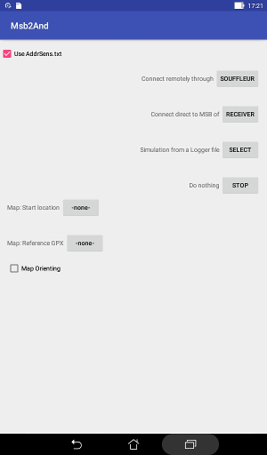
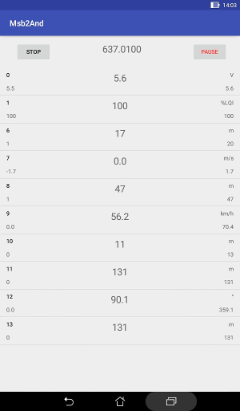

# First use

This application is displayed only in portrait orientation.

## Storage

At the first use this application requests the right to write to the
internal SD card. This is usually a partition set aside from the
main storage.  
It is possible to work without granting this permission: there is then
no saving of data.

This application has for base on the SD card a directory "**MSBlog**" that
it is able to create. This directory is shared with the other
application of the family: Msb2Kml.  
It is created if not already existing. This directory is located
in the directory /storage/sdcard/ or /storage/emulated/0/,
function of the Android version.  
This directory could contain a file "**AddrSens.txt**"
used to customize the headings and to provide formulas
for advanced usage. If this file does not exist,
the program proposes to create a default one.  
The user has to edit this file to adapt it to the settings
of her/his telemetry system.

The telemetry data is recorded in files mimicking the ones recorded
by the Multiplex Flight Recorder. Theses files have a name of the
form "**MSB\_xxxx.csv**" where "xxxx" is a unique number from "0000" to
"9999".  
The files are spread in sub directories named as "**Allexx**"
where "xx" is the 2 first digits of the "xxxx" of the files it contains.
Theses sub directories are created as needed.  
The Flight Recorder starts the sequence of files at "**MSB\_0000.csv**"
and increments.  
This application Msb2And start at "**MSB\_5000.csv**" and increments
until a free name is found.

## Starting
The USB-OTG cable should be connected to the Android device.
For some configurations it is necessary to provide a power supply
to the USB bus.  
The Multiplex interface cable should be connected on a side to
the USB-OTG cable and on the other side to the MSB connector
of the Souffleur or to the sensor port of the receiver.

The application is launched from a red and green icon with
the letters "M/A".

Once the application is launched you have to chose between a setup
for the Souffleur or for the receiver. The configuration of the
interface is specific for each possibility.

There is a third possibility: simulating a flight by reading
a log file produced by the Multiplex Flight Recorder.  
This is a file with a name like "**MSB_xxxx.csv**": see "**Simulation**"
in this directory.

There is also an option to use or not the file AddrSens.txt.  
If this file is used and a GPS track reconstruction is
scheduled you should provide the name of the start location
and maybe the name of a reference GPX file to display
on the map: see the file "**RemoteGPS**" in this directory.

.

## Monitoring
Once the data source has been selected you are presented with
a button "**Start**". Listening for data starts when this button is pushed.  
You could have to authorize the access to the USB port.

So long as data is received you have a running count of the seconds
at the top of the screen.  
Under this you have a list with an entry for each address in use
on the telemetry bus.  
For each entry:  

  * on the left, the address (0-15) and the minimum value measured.
  * in the center, the value currently measured.
  * on the right, the maximum value measured and the unit of measurement.

Scrolling could be used to see the higher addresses.  
The screen never sleep in this phase.

.

This could be followed by entries for processed data: see "**AdvancedUse**".

If there is an alarm for an address, its number is displayed in red.
If no value is received for some sensor, the last value received
is kept but displayed between parenthesis.

The file "**AddrSens.txt**" on the base directory "**MSBlog**"
could be used to give a name to the addresses

### Basic use of AddrSens.txt
This file provides some customization.  
Any line of this file starting with a star "\*" is a comment that
is skipped.  
Each active line is composed of 3 fields separated by a semi-colon ";"
but the third field is optional.  
For the basic usage, the first field has to be exactly as the heading of
a column as delivered by the Flight Logger: "Time" and " A:00" to " A:16"
(note the space).  
For each address on which telemetry data is received,
a string of characters of the form " A:xx" is generated and compared
to the first field of each line of the file.  
If there is a match, the second field is displayed in the place
of the address; however if this field is a minus "-", the entry for
this address is not displayed (but could be used for computation).

If the third field is present, it should be a single character (any character,
any case).  
This character is used as name of a variable that point to the
value of the entry for each sample: see "**AdvancedUse**".  
The significant character for this third field could be preceded
by ignored white spaces: this provides for a better readability.

.

## Stop monitoring
The application run until the "**Stop**" button is pushed.  
It is the end if the right to write to storage has not been granted.

Otherwise, some information is given or requested about
the two generated files:

 * the CSV log file (like the ones from the Flight Recorder).
 * the "meta" file that could be used to help the processing of the
log with the Msb2Kml application.

The "meta" file contains the date and hour of the flight, the
name of the starting location if one has been entered, the name
of the plane and a comment.  

There are fields to enter the plane name and the comment.  
Then there are 2 buttons: "**Forget it**" and "**Record it**".
The files are not recorded but erased if "**Forget it**" is pushed and kept
if the other button is pushed.
