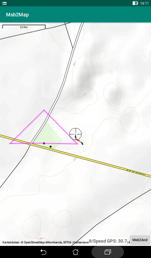
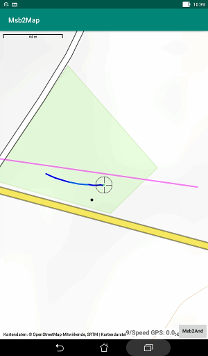

# Displaying the position of the plane on a map

To train for better performances in some flight episodes like a
terrain approach and for some activities like the GPS triangle,
it is useful to see the real time position of the plane on a map.  
This is possible with three prerequisites:

+ The file AddrSens.txt is used (advanced use).
+ The GPS data is received and processed.
+ The application [Msb2Map](https://github.com/msb2kml/Msb2Map)
 is installed.

## Launching the map

While the parameters are displayed, taping on any parameter,
direct or computed, launch the **Msb2Map** application.  
**Msb2And** is still running in the background.  
It is using an Android mechanism of internal broadcasting to
send the geographic position of the plane and the value of the
parameter that has been taped.  
The color defined by the variable "**%**" in AddrSens.txt is
sent along the position to colorize the tail.
**Msb2Map** receives this data and display it while running.  
The current position of the plane is materialized by a reticle marker.
Taping on this marker shows a bubble with the altitude (height
above sea level).  
A tail of the 20 last position is displayed.  
The starting location is marked with a small black dot.

If **Msb2Map** is terminated, **Msb2And** comes back to the foreground
and another parameter could be used.

It is still possible to scroll the display of Msb2And by dragging
with the finger.

## Reference GPX

A reference GPX file could have been selected on the initial menu
of the application. 
The waypoints it contains are displayed as half transparent magenta
color diabolos; routes and tracks are displayed as lines
with a uniform half transparent magenta color.  

The waypoints could be virtual pylons.  
One could want to re-enact some track.
The routes could be some path to follow (like GPS triangle).

A route could also mark the border of a security zone.  
Or it could be an approach path.

## Map orientation

There is a field "**Map Orienting**" on the initial menu.

+ Field NOT checked: the North of the map is at the top of the screen.
 It is possible to rotate the map with a twist of the fingers.
+ Field checked: the map is automatically rotated so that the progression
 is always toward the top of the screen.

## Why two applications?

**Msb2And**

+ Not everybody need a map while flying.
+ Access to the location service (GPS) of the device is needed
 to enter the starting location.
+ Access to the Internet is not needed.

**Msb2Map**

+ Access to the location service is not needed.
+ Access to the Internet is needed to fetch the map.
+ There could be other uses in the future (Msb2Kml and Vtrk).  

