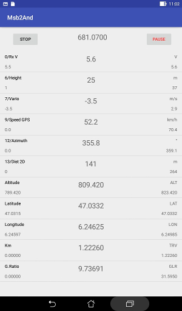

# Purpose
The Msb2And Android application is designed to display in flight the
data collected by the sensors on the MSB telemetry bus.  
It is able to use this data to compute and display secondary parameters.  
Among theses capabilities there is the possibility to compute
the geographic position of the plane from the telemetry
data sent by the GPS module and to display it on a map.  
This application is probably more useful to a coach than
directly to the pilot.

The Android device is connected remotely through a
[Multiplex Souffleur](https://www.multiplex-rc.de/Downloads/Multiplex/Bedienungsanleitungen/45185-bedienungsanleitung-souffleur--de-en-fr-it-es.pdf) or
directly to the MSB bus of the receiver (for a test on the ground).  
It could also be connected to the COM port of a Multiplex HF module.

You need a USB-OTG cable and a
[Multiplex USB interface](https://www.multiplex-rc.de/produkte/85149-usb-pc-kabel-rx-s-telemetrie-uni).

The application should be authorized to obtain the geographic location
from the GPS.  
If the application is authorized to write to the storage system,
it could record files with the same format as the
[Multiplex Flight Recorder](https://www.multiplex-rc.de/produkte/85420-flightrecorder).  
Theses files could be used with the
[Msb2Kml application](https://github.com/msb2kml/Msb2Kml).

There is also a possibility to use one of theses files to simulate
a flight.

This Android/Java application could be installed if you have
checked that applications from other sources than Google Play
could be installed.  
It should work on Android versions from Jelly Bean (4.1) to
Oreo (8.0).  
It could be compiled from the sources in this repository or
downloaded from the [Releases](https://github.com/msb2kml/Msb2And/releases)
pages.

In each case the application package (such as Msb2And160.apk) should be
transferred to the storage of the device (such as Downloads).
Selecting it with a File Manager should offer the opportunity
to install it.

# Library
This application make use of the library
[UsbSerial](https://github.com/felHR85/UsbSerial).

# Screenshot

Slope soaring:

